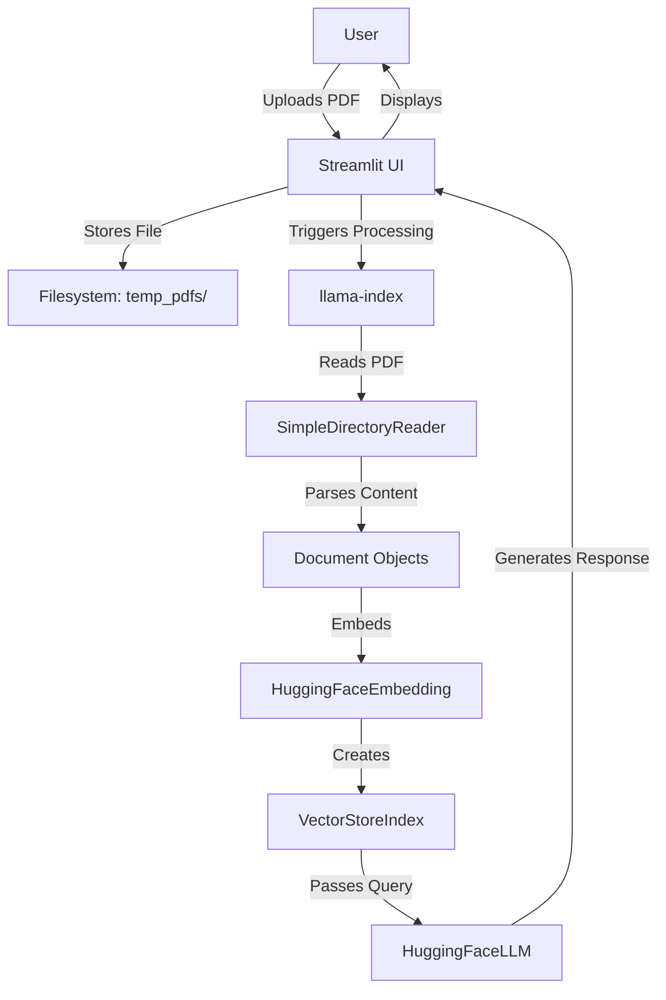

# AI Doc Agent(ADA)

This repository implements a **Retrieval-Augmented Generation (RAG) Chatbot** web application using [Streamlit](https://streamlit.io/), [llama-index](https://github.com/run-llama/llama_index), and Hugging Face LLMs. The app allows users to upload PDFs and interact with a chatbot that answers queries based on the content of the uploaded PDF using advanced language models and vector-based retrieval.

---

## Table of Contents
- [Features](#features)
- [Technical Stack](#technical-stack)
- [Architecture](#architecture)
- [Setup Instructions](#setup-instructions)
- [Usage Guide](#usage-guide)
- [Core Components](#core-components)
- [Skills and Concepts](#skills-and-concepts)
- [Customization](#customization)
- [Troubleshooting](#troubleshooting)
- [License](#license)

---

## Features

- **PDF Upload**: Users can upload PDF documents via the Streamlit sidebar.
- **RAG-based Chatbot**: Utilizes Retrieval-Augmented Generation to answer questions grounded in the uploaded PDF content.
- **Session-based Chat History**: Maintains chat history across interactions using Streamlit's session state.
- **LLM Integration**: Leverages Hugging Face LLMs (Llama-2 7B Chat) for generating responses.
- **Efficient Embeddings**: Uses sentence-transformers for semantic indexing.
- **Quantization**: Supports BitsAndBytes quantization for resource-efficient inference.
- **User Authentication**: Authenticates with Hugging Face using secure tokens.

---

## Technical Stack

- **Streamlit**: Rapid web UI development for interactive data apps.
- **llama-index**: Framework to connect LLMs with external data sources for retrieval-augmented generation.
- **Hugging Face Transformers**: Provides cutting-edge language models and embeddings.
- **sentence-transformers**: Efficient embedding generation for semantic search.
- **BitsAndBytes**: Enables quantized inference for large models.
- **Python 3.8+**

---

## Architecture



---

## Setup Instructions

### 1. **Clone the Repository**
```bash
git clone https://github.com/CHANNAKAMANIDEEP/RAG_webUI.git
cd RAG_webUI
```

### 2. **Install Dependencies**
It's recommended to use a virtual environment.

```bash
pip install -r requirements.txt
```
**Key packages:**
- `streamlit`
- `llama-index`
- `transformers`
- `sentence-transformers`
- `bitsandbytes`
- `huggingface_hub`
- `torch`

### 3. **Configure Hugging Face Token**
Obtain your Hugging Face access token from [Hugging Face settings](https://huggingface.co/settings/tokens).

Set the token in Streamlit secrets (`.streamlit/secrets.toml`):

```toml
HUGGINGFACE_TOKEN = "your_hf_token_here"
```

Or set the environment variable:

```bash
export HUGGINGFACE_TOKEN=your_hf_token_here
```

### 4. **Run the Application**
```bash
streamlit run app.py
```

---

## Usage Guide

1. **Upload PDF**: Use the sidebar to upload your PDF document.
2. **Ask Questions**: Enter your query in the main input field and click "Send".
3. **View Responses**: The chatbot will answer using RAG, leveraging both the PDF and LLM.
4. **Chat History**: View previous queries and responses in the sidebar or main section.
5. **Clear History**: Use the "Clear Chat History" button to reset the interaction.

---

## Core Components

### 1. **PDF Ingestion**
- Utilizes `SimpleDirectoryReader` from llama-index to parse PDFs.
- Uploaded PDFs are stored in a temporary directory (`temp_pdfs/`).

### 2. **Embedding & Indexing**
- Employs `HuggingFaceEmbedding` (`sentence-transformers/all-MiniLM-L6-v2`) for document embeddings.
- Documents are indexed with `VectorStoreIndex` for efficient semantic retrieval.

### 3. **LLM Integration**
- Uses `HuggingFaceLLM` with `meta-llama/Llama-2-7b-chat-hf` for response generation.
- Configurable context window (`4096`), max tokens (`256`), and temperature (`0.5`).
- Supports quantization via `BitsAndBytesConfig` for memory efficiency.

### 4. **RAG Workflow**
- System prompt guides the LLM to answer based on instructions and context.
- Responses are generated by combining retrieved document chunks and LLM outputs.

### 5. **Session Management**
- Maintains chat history and uploaded PDF list using `st.session_state`.

---

## Skills and Concepts

### **Retrieval-Augmented Generation (RAG)**
- Enhances LLMs with context from external documents.
- Employs document embeddings and vector similarity for relevant retrieval.

### **Streamlit**
- Interactive web app for data science and machine learning workflows.
- Enables rapid prototyping and deployment.

### **llama-index**
- Connects language models with knowledge bases for retrieval-augmented tasks.
- Handles document ingestion, indexing, and retrieval logic.

### **Hugging Face LLMs**
- State-of-the-art transformer models for natural language understanding and generation.
- Supports quantization for scalable deployment.

---

## Customization

- **Model Selection**: Swap out the embedding or LLM models by changing `model_name`.
- **Token Management**: Adjust token and context window settings for different use cases.
- **UI Enhancements**: Extend the Streamlit interface for multi-file support or richer chat formatting.
- **Security**: Integrate authentication for enterprise deployment.

---

## Troubleshooting

- **Missing Hugging Face Token**: Ensure your token is set in secrets or environment variables.
- **CUDA/Hardware Issues**: Make sure your environment supports PyTorch and BitsAndBytes if using quantization.
- **PDF Parsing Errors**: Use standard PDF formats; malformed PDFs may not be parsed correctly.
- **Model Loading Errors**: Download required models manually if network issues persist.

---

## License

This project is licensed under the MIT License. See [LICENSE](LICENSE) for details.

---

## Acknowledgements

- [Streamlit](https://streamlit.io/)
- [llama-index](https://github.com/run-llama/llama_index)
- [Hugging Face](https://huggingface.co/)
- [sentence-transformers](https://www.sbert.net/)
